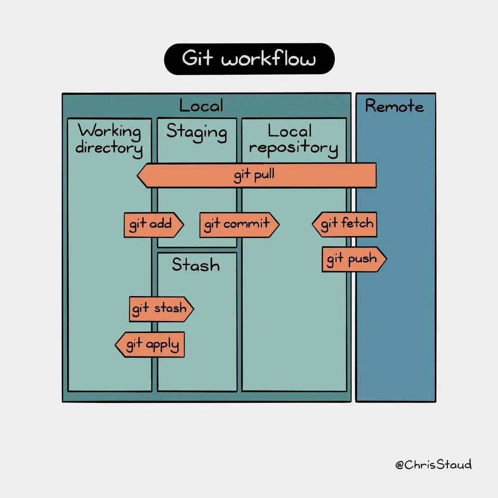

# Git
## The workflow of Git

## Documents

| Usage | Notes |
|-|-|
| Basic commands | [✓](./docs/commands.md) |
| Basic settings | [✓](./docs/settings.md) |
| How to remove the `.DS_Store` file in mac | [✓](./docs/rm_dsstore.md) |
| Draw your folder sturcture with git and tree | [✓](./docs/tree.md) |
| Usage of git submodule | [✓](./docs/submodule.md) |
| What is detached HEAD?     | [🔧](./docs/detached_head.md) |
| `git rebase` vs `git merge` | [✓](./docs/rebase.md) |